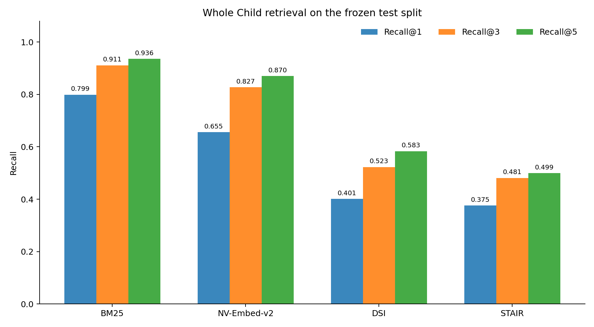
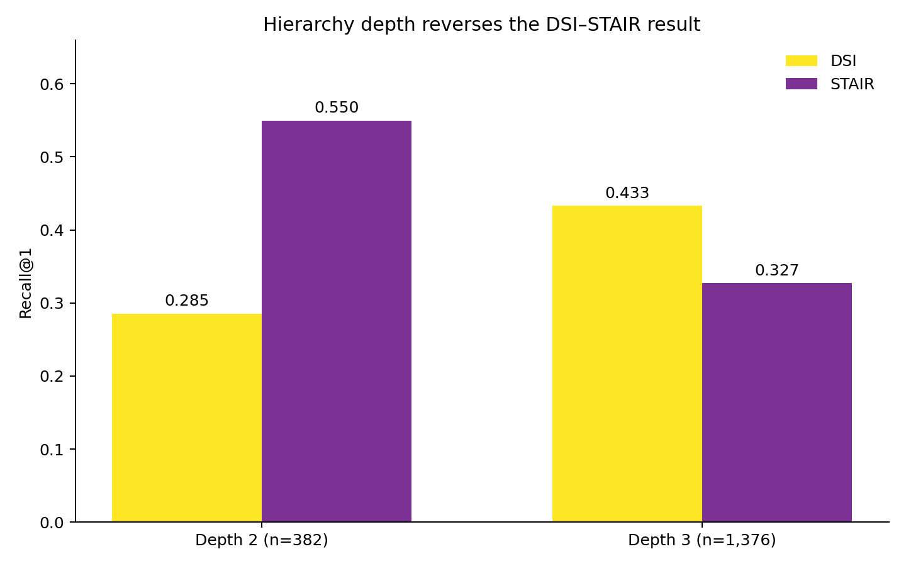

# When document hierarchy helps retrieval—and when it hurts

[](https://github.com/NaveenGali11/stair-rag-reproduction/actions/workflows/validate.yml)
[](https://www.python.org/)
[](LICENSE)
[](DATA_LICENSE.md)

An auditable, one-book reproduction of **STAIR (STructure Aware Information
Retriever)** that compares lexical, dense, and generative retrieval over the
hierarchy of an open textbook.

> **Three results surprised us.** BM25 was the strongest retriever by a wide
> margin (`0.7986` Recall@1). STAIR did **not** reproduce an aggregate advantage
> over a Differentiable Search Index (DSI): `0.3754` versus `0.4010`. But that
> average conceals the useful finding—STAIR gained `+0.2644` on depth-2
> sections and lost `-0.1061` on depth-3 leaves.

This is an independent reconstruction of Kumar et al.'s
[STAIR paper](https://arxiv.org/abs/2609.03874), not the authors' official
implementation. The paper's original anonymous repository was unavailable
during this work.



## Why this matters

Document structure is useful, but it is not a free accuracy boost. In this
experiment, hierarchy helped when the target was shallow and well represented
in development data; longer paths and unseen development labels made the
generative task substantially harder. The result suggests that future
structure-aware retrievers should separate the value of ToC context from the
difficulty of generating a complete path—and should still earn their place
against a strong lexical baseline.

The repository includes the complete tracked dataset, leakage-safe splits,
training inputs, frozen metrics, an executed notebook, and every script needed
to inspect or rerun the experiment. A clone can validate the scientific record
without downloading a model:

```bash
git clone https://github.com/NaveenGali11/stair-rag-reproduction.git
cd stair-rag-reproduction
python3 scripts/validate_repository.py
```

Expected final line: `Repository validation passed`.

## Results

All systems use the same frozen, passage-grouped test split: 1,758 questions,
129 candidate leaves, and 86 represented gold leaves.

| Retriever | Recall@1 | Recall@3 | Recall@5 | nDCG@3 | Macro leaf R@1 |
|---|---:|---:|---:|---:|---:|
| BM25 | **0.7986** | **0.9107** | **0.9357** | **0.8648** | **0.7999** |
| NV-Embed-v2 | 0.6553 | 0.8271 | 0.8697 | 0.7553 | 0.7535 |
| DSI | 0.4010 | 0.5228 | 0.5830 | 0.4716 | 0.3957 |
| STAIR | 0.3754 | 0.4812 | 0.4994 | 0.4373 | 0.3295 |

The paired DSI–STAIR comparison is borderline: exact two-sided McNemar
`p = 0.0543`; the paired-bootstrap 95% interval for STAIR minus DSI is
`[-0.0506, 0.0000]`.



- At depth 2 (`n=382`), STAIR leads by **+0.2644 Recall@1**.
- At depth 3 (`n=1,376`), STAIR trails by **-0.1061 Recall@1**.
- On leaves seen in development, the systems are close: 0.4002 DSI versus
  0.3916 STAIR.
- On leaves absent from development, STAIR falls to 0.1944 versus 0.4097 for
  DSI. Those 144 queries explain most of the aggregate gap.

See [RESULTS.md](RESULTS.md) for the concise report,
[the executed notebook](notebooks/whole_child_results.ipynb) for the visual
analysis, [the long-form article](docs/BLOG.md) for the narrative, and
[the frozen JSON](results/whole-child-results.json) for exact metrics,
training histories, artifact paths, sizes, and SHA-256 hashes.

## What is being tested?

The retrieval unit is a leaf in a document's Table of Contents (ToC), not an
arbitrary fixed-size chunk.

| Method | Query-time input | Retrieval mechanism | Output |
|---|---|---|---|
| BM25 | Query | Lexical index over leaf text | Ranked leaf IDs |
| NV-Embed-v2 | Query | Dense similarity over leaf embeddings | Ranked leaf IDs |
| DSI (Differentiable Search Index) | Query | Fine-tuned Mistral-7B | Opaque leaf ID |
| STAIR | Complete ToC + query | Fine-tuned Mistral-7B | Canonical ToC path |

DSI and STAIR use the same base model, LoRA configuration, supervision,
five-epoch budget, seed, and constrained candidate vocabulary. They differ in
their input and target representation: this reproduces the end-to-end systems
described in the paper, but it does **not** isolate ToC input from path-output
difficulty. A two-by-two ablation is the natural follow-up.

For one real test query, the two generative formulations look like this:

| Field | Example |
|---|---|
| Query | What organization defines key periods of child development from infancy to young adulthood? |
| Gold leaf | `Periods of Development` |
| DSI target | `whole-child-009` |
| STAIR target | `Chapter One: Perspectives on Early Childhood > Childhood Defined > Periods of Development` |

DSI emits a short opaque identifier. STAIR receives the complete ToC and must
generate the exact hierarchical path. That distinction is useful, but also
means this experiment compares two end-to-end systems rather than isolating a
single hierarchy variable.

## Corpus and supervision

The experiment uses *The Whole Child: Development in the Early Years* by
Deirdre Budzyna and Doris Buckley, published by ROTEL under
CC BY-NC-SA 4.0. It was selected because its publisher PDF is openly licensed
and exposes a meaningful native Table of Contents; it is a focused case study,
not a representative sample of all document hierarchies.

- 183-page publisher PDF; SHA-256
  `14c95ceb029cafaf98f9f2c67e3b73baa8177b53ca3198519c3a2ec19c547d75`
- 181 native ToC nodes and 129 semantic retrieval leaves
- 1,019 validated PDF paragraph blocks
- 555 cleaned question-generation units
- 3,214 validated questions across all 129 leaves
- grouped split: 1,064 train / 392 development / 1,758 test questions

Questions from the same source unit never cross splits. All leaves occur in
training; 66 occur in development and 86 in test. See
[data/MANIFEST.md](data/MANIFEST.md) and [DATA_LICENSE.md](DATA_LICENSE.md)
before reusing the data.

## Repository map

```text
data/derived/             validated ToC, sections, paragraphs, and units
data/splits/              frozen leakage-safe question splits
data/retriever/           DSI and STAIR prompts/targets
notebooks/                executed results notebook
reports/figures/          versioned plots used in the report
results/                  compact frozen metrics and artifact manifest
scripts/                  extraction, validation, training, and evaluation
RESULTS.md                short result report
Makefile                  reproducible command entry points
```

Large downloads, embeddings, predictions, model adapters, and training state
live under ignored `artifacts/` paths. They are intentionally not committed.
The frozen result manifest records their expected hashes.

## Quick start

Choose the smallest path that answers your question:

| Goal | What you need | Start here |
|---|---|---|
| Audit the published result | Python 3; no installation or model download | `python3 scripts/validate_repository.py` |
| Re-run BM25 and the figures | Any ordinary CPU environment | `make setup-core && make evaluate-bm25 && make report` |
| Retrain DSI and STAIR | Linux, CUDA, pinned Mistral checkpoint, high-memory GPU | Start at retriever setup in [REPRODUCING.md](docs/REPRODUCING.md#6-create-the-retriever-environment-and-data) |
| Rebuild from the source PDF | Linux, L40S-class GPU, about 80 GB free disk, three model snapshots | Follow [the full staged guide](docs/REPRODUCING.md#level-3-full-reproduction) |

The retriever-ready train/dev/test records are committed. Researchers who only
want to train or evaluate DSI and STAIR can skip PDF extraction and Mixtral
question generation entirely.

### 1. Inspect the frozen result

No GPU or package installation is needed. Open
[RESULTS.md](RESULTS.md), the
[executed notebook](notebooks/whole_child_results.ipynb), or inspect:

```bash
python -m json.tool results/whole-child-results.json >/dev/null
python scripts/validate_repository.py
```

### 2. Re-run the CPU baseline and figures

Python 3.12 was used for the experiment.

```bash
python3 -m venv .venv
source .venv/bin/activate
python -m pip install --upgrade pip
python -m pip install -r requirements.txt

python scripts/evaluate_bm25.py
python scripts/plot_results.py
```

Equivalent Make targets are available:

```bash
make setup-core
make validate-repository
make evaluate-bm25
make report
```

### 3. Full GPU reproduction

The full run requires Linux, CUDA, substantial local disk, and access to the
pinned Hugging Face checkpoints. It was validated on one NVIDIA L40S with
approximately 46 GiB of VRAM. Question generation uses a separate vLLM
environment because its CUDA/runtime requirements conflict with NV-Embed and
the retriever trainer.

Follow [docs/REPRODUCING.md](docs/REPRODUCING.md) for the staged commands,
hardware expectations, immutable model revisions, and artifact flow. Do not
start by installing every requirements file into one environment.

## Reproducibility boundaries

- The current publisher PDF has 183 pages; the paper reports 182.
- The paper's generation prompt, code, exact split, and original SearchTome
  release were unavailable, so question generation and preprocessing were
  reconstructed and documented.
- The paper evaluates 18 books; this repository evaluates one book.
- Only one training seed and a five-epoch shared budget were used.
- BM25 uses `rank-bm25`, not the paper's Elasticsearch implementation.
- The frozen questions are synthetic and derived from a single textbook.
- BM25 and NV-Embed report full-candidate MRR; DSI and STAIR report MRR@5
  from five constrained beams.
- Reported inference timings are system-specific and exclude cold checkpoint
  loading. NV-Embed's cold load from the attached volume took 45.5 minutes.

These constraints make the result a **boundary-condition study**, not a claim
that the paper's multi-book finding is false.

## Paper and model references

- Vineet Kumar, Meghanadh Pulivarthi, Vishwajeet Kumar, Jaydeep Sen, Riyaz
  Ahmad Bhat, and Sachindra Joshi. “STAIR (STructure Aware Information
  Retriever): A novel dataset and LLM based retriever for document structure
  augmentation.” [arXiv:2609.03874](https://arxiv.org/abs/2609.03874), 2026.
- Base retriever: `mistralai/Mistral-7B-Instruct-v0.2`, revision
  `63a8b081895390a26e140280378bc85ec8bce07a`.
- Dense baseline: `nvidia/NV-Embed-v2`, revision
  `3fa59658547db50a1e8e3346cf057fd0c77ed6ef`.
- Question generator: `casperhansen/mixtral-instruct-awq`, revision
  `0a898130957afe22021bbaf807f50f6bbce88201`.

## License and citation

Repository code is released under the [MIT License](LICENSE). The textbook and
textbook-derived data are governed separately by CC BY-NC-SA 4.0; see
[DATA_LICENSE.md](DATA_LICENSE.md). Third-party models retain their own
licenses and terms.

Use [CITATION.cff](CITATION.cff) to cite this reproduction and cite the
original STAIR paper separately. See [CONTRIBUTING.md](CONTRIBUTING.md) before
proposing changes to the frozen scientific record.
